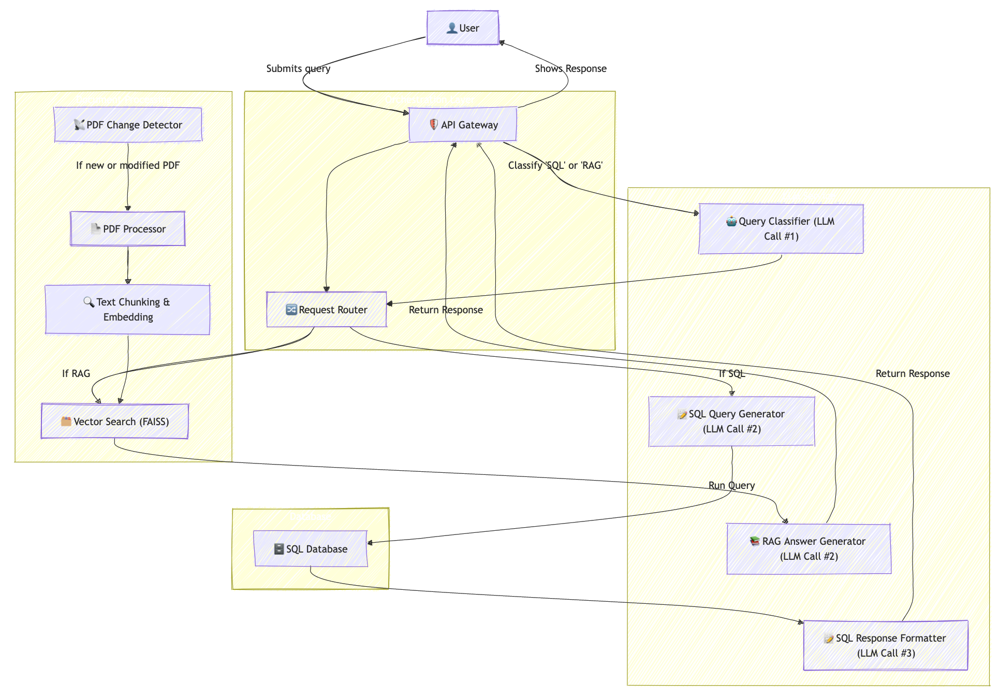

# ChatFactory – Intelligent Query & Troubleshooting Assistant

ChatFactory is an LLM powered assistant designed to answer user's query about industrial operations and asset troubleshooting in a natural, conversational way

## Features

- **SQL Query Generation**: Converts natural language questions into **SQL queries**, executes them, and presents human-readable responses.
- **Retrieval-Augmented Generation (RAG)**: Extracts relevant troubleshooting information from uploaded **PDF user manuals**.
- **Customizable for Industry**: Can be used for different customers and industries with changes in system prompts.

## Setup Instructions

1. Clone the repository
2. `cd` into the repository
3. Install the requirements using `pip install -r requirements.txt`
4. Set the following database environment variables: `DB_USER`, `DB_PASSWORD`, `PUBLIC_IP`, `DB_NAME`, `DB_PORT`
5. Set the following OpenAI and Huggingface environment variables: `OPENAI_API_TOKEN`, `HUGGINGFACE_TOKEN`
6. Run the application using `streamlit run streamlit_app.py`

## Database
The application relies on having access to a database with the following tables and columns:
1. machine_status_2 - Tracks machine downtime.
   - `id` (INT) - Unique ID for the database table
   - `machine_name` (TEXT) - Contains values: 'CNC Lathe-1000', 'Hydraulic Press-200', 'Laser Cutter-X5'
   - `last_downtime` (DATE) – Represents when a machine last had an issue.
   - `downtime_duration` (INT) – The duration the machine was down in minutes
   - `issue_description` (TEXT) – Contains values: 'Coolant leakage', 'Overheating motor', 'Tool misalignment', 'Excessive vibration'

2. production_log - Stores production details.
   - `data_id` (INT)
   - `production_date` (DATE) – Represents the shift date.
   - `shift` (TEXT) – Contains values: 'morning_shift', 'afternoon_shift', 'night_shift'.
   - `units_produced` (INT) – Number of units produced during the shift.

3. inventory - Stores current inventory details.
   - `id` (INT)
   - `part_name` (TEXT) – Contains value: "Bearing Assembly", "Hydraulic Seal", "Drive Belt", "Control Valve",
        "Pressure Gauge", "Circuit Board", "Motor Coupling", "Filter Element",
        "Gear Set", "Pneumatic Cylinder"
   - `storage_location` (TEXT) – Contains values: 'Container-1', 'Container-2' ,'Shelf-A', 'Shelf-B' 
   - `quantity` (INT) – Number of units in the inventory
   - `last_updated` (DATE) - Represents when the inventory was last updated

## Flowchart

## System Architecture

